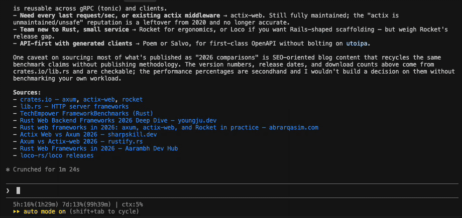

# cclinks

**English** | [日本語](README.ja.md)

Open links from your Claude Code sessions with the keyboard, without touching the mouse.

Claude Code renders `[label](url)` as **the label only**. The URL never reaches the terminal
buffer, so tools that scrape the screen — `tmux-fzf-url`, your terminal's own link detector,
VS Code's *Open Detected Link* — cannot find it. There is nothing on screen to find.

`cclinks` reads the session transcripts instead, where the URLs are still intact — across
every project and every tab, with each row saying which session it came from.



The `Sources:` list behind the popup is what Claude Code actually printed: labels, and not
one URL among them. The picker has all eleven.

Pick with the arrow keys or by typing, press Enter, and the link opens in your browser.

## Why not just scrape the screen, or click the link?

|                              | Screen scraping | Ctrl/⌘-click | cclinks |
| ---------------------------- | --------------- | ------------ | ------- |
| Bare URLs                    | Yes             | Yes          | Yes     |
| Markdown links               | **No**          | Yes¹         | Yes     |
| Scrolled out of view         | **No**          | **No**       | Yes     |
| Label available for search   | No              | No           | Yes     |
| Without leaving the keyboard | Yes             | **No**       | Yes     |

¹ In terminals that render OSC 8 hyperlinks — iTerm2, WezTerm, Ghostty, the VS Code and
Cursor integrated terminals. The URL is still absent from the buffer; the terminal holds it
out of band.

Clicking works, and it is the reason this tool is not about *reaching* the link. It is about
not moving your hand to reach it. If your hands are on the keyboard while Claude is talking,
they stay there.

Screen scrapers are still useful for file paths and for output from other programs.
The two complement each other; bind them to neighbouring keys.

## Install

Requires Python 3.10+ and [fzf](https://github.com/junegunn/fzf).

```sh
uv tool install git+https://github.com/takkuhiro/cclinks
```

Or with pipx:

```sh
pipx install git+https://github.com/takkuhiro/cclinks
```

## Usage

```sh
cclinks                    # pick a link and open it
cclinks --print            # list links, open nothing
cclinks --all              # every session ever recorded, not just the recent ones
cclinks --since 30d        # widen the window (12h, 7d, 2w, or all)
cclinks --limit 50         # read more sessions (0 for no cap)
cclinks --scope project    # only the sessions for this directory
cclinks --scope session    # only one session
cclinks --active           # only the session you last typed into (needs a hook, below)
cclinks --latest           # only the most recently updated session
cclinks --cwd PATH         # target a specific directory
cclinks --no-color         # do not color the picker
```

By default it gathers the **20 most recent sessions from the last 7 days, across every
project**. Sessions are listed newest first, and links keep the order they appeared in.

A URL is listed once even if several sessions mentioned it, attributed to the newest one.
When the same URL appears both as a bare URL and as a Markdown link, the label is kept.

### Where each link came from

Once more than one session is on screen, every row is led by the session it came from:

```
cclinks/Origin column for the picker   │  the fzf manual    ⟶  https://github.com/junegunn/fzf
techblogs/Draft on transformer memory  │  the original PDF  ⟶  https://arxiv.org/abs/...
```

The name is the project directory, then the title the session gave itself (falling back to
what you last asked it, and then to a short session id). It is searchable like everything
else on the row, so typing a project name narrows the list to that project.

The column is dropped entirely when every link comes from the same session — there is
nothing to tell apart — which is what `--scope session`, `--latest` and `--active` give you.

### Colors

The picker colors the label, the URL and the origin differently so the list reads by label.
Override with raw SGR parameters, or turn it off:

```sh
CCLINKS_LABEL_COLOR=35 cclinks   # magenta labels (default: 36, cyan)
CCLINKS_URL_COLOR=32 cclinks     # green URLs     (default: 90, grey)
CCLINKS_ORIGIN_COLOR=90 cclinks  # grey origins   (default: 35, magenta)
CCLINKS_ORIGIN_WIDTH=48 cclinks  # a wider origin column (default: 32 columns)
cclinks --no-color
```

Japanese titles cost two columns per character, so `CCLINKS_ORIGIN_WIDTH` is worth raising
on a wide terminal.

`--print` is always plain, so it stays usable in a pipe.

### Which sessions does it read?

All of them, within a window: the 20 most recent sessions touched in the last 7 days.
`--limit` and `--since` move those two numbers, `--all` removes both, and `--scope`
narrows by project instead of by time:

| | reads |
| --- | --- |
| *(default)* | every project, newest 20 sessions of the last 7 days |
| `--all` | every session of every project, however old |
| `--scope project` | every session for `--cwd`, same window |
| `--scope session` | one session: the newest for `--cwd`, or the newest anywhere if that directory has none |
| `--latest` | one session: the most recently updated, whatever the directory |
| `--active` | one session: the one you last typed into |

The window exists because a picker of every link you have ever been shown is not a picker.
When nothing turns up, the empty picker says how far back it looked, so widening with
`--all` is the obvious next move.

#### Reading one session

The single-session modes are for when you want *this tab* and nothing else. Picking the
right one is harder than it sounds: a picker started from a hotkey is a *sibling* of Claude
Code, not a child, so `CLAUDE_CODE_SESSION_ID` never reaches it, and several sessions
routinely share a working directory. Modification time is a poor tiebreak too — a tab
working through a long task writes continuously, so it wins on mtime while you are reading
a different one.

`--active` uses the session you last typed into, which is a much closer match for the tab
in front of you. The session has to announce itself, which is what the hook below does.

#### The hook

`contrib/user-prompt-submit-hook.sh` records the session on every prompt you submit. It
needs [jq](https://jqlang.github.io/jq/). Copy it somewhere, `chmod +x` it, then add this
to `~/.claude/settings.json`:

```jsonc
"hooks": {
  "UserPromptSubmit": [
    {
      "hooks": [
        {
          "type": "command",
          "command": "bash /path/to/user-prompt-submit-hook.sh",
          "timeout": 5
        }
      ]
    }
  ]
}
```

It writes `~/.claude/cclinks-active.json` — the session id, its transcript path, and its
working directory. Not the prompt itself. Override the location with
`CCLINKS_ACTIVE_FILE`.

Without the hook, `--active` behaves exactly like `--latest`, so you can put it in a
keybinding first and set the hook up afterwards.

## Binding it to a key

Claude Code occupies the terminal, so the picker has to run somewhere else. Pick whichever
fits your setup.

The examples below use the default, which gathers recent sessions and labels each row with
its origin. Add `--active` once the hook is in place if you would rather see only the tab in
front of you.

### tmux

Needs tmux 3.2 or newer for `display-popup`.

```tmux
bind-key u display-popup -E -w 80% -h 60% "cclinks"
```

The popup does not source your shell rc, so it uses the PATH the tmux server
started with. If the popup flashes and vanishes, use an absolute path instead.

### Shell alias

```sh
alias ccl='cclinks'
```

### VS Code / Cursor task

Two files, both in the user directory rather than a workspace, so the key also works in a
window with no folder open.

First the task, in `~/Library/Application Support/Cursor/User/tasks.json` (for VS Code,
`Code` in place of `Cursor`).

```jsonc
{
  "version": "2.0.0",
  "tasks": [
    {
      "label": "cclinks",
      "type": "shell",
      "command": "${userHome}/.local/bin/cclinks",
      "options": {
        "env": { "PATH": "/opt/homebrew/bin:/usr/local/bin:/usr/bin:/bin:${env:PATH}" }
      },
      "presentation": {
        "echo": false, "reveal": "always", "focus": true,
        "panel": "dedicated", "close": true, "clear": true, "showReuseMessage": false
      },
      "problemMatcher": []
    }
  ]
}
```

The task shell does not inherit your interactive `PATH`, which is why the command and the
`PATH` entry are spelled out.

Then the key, in `keybindings.json` beside it:

```jsonc
{
  "key": "alt+cmd+q",
  "command": "workbench.action.tasks.runTask",
  "args": "cclinks",
  "when": "terminalFocus"
}
```

`terminalFocus` keeps the binding to the terminal, so the key stays free while you are
editing. Drop it to reach the picker from anywhere in the window.

### Raycast

Drop a script command in your Raycast script directory and give it a hotkey:

```sh
#!/bin/bash
# @raycast.schemaVersion 1
# @raycast.title cclinks
# @raycast.mode silent
open -a Terminal "$HOME/.local/bin/cclinks"
```

## Development

```sh
uv sync
uv run pytest
```

## Limitations

- Only Claude Code transcripts (`~/.claude/projects/**/*.jsonl`) are supported.
- Session titles come from a field Claude Code writes for its own use, which is not a
  documented format. If it ever changes, rows fall back to the last prompt and then to a
  short session id; nothing else breaks.
- The transcript is written when a response completes, so a link is pickable only after
  Claude finishes speaking.
- `open` / `xdg-open` are used to launch the browser. Tested on macOS with tmux 3.6.

## License

MIT
